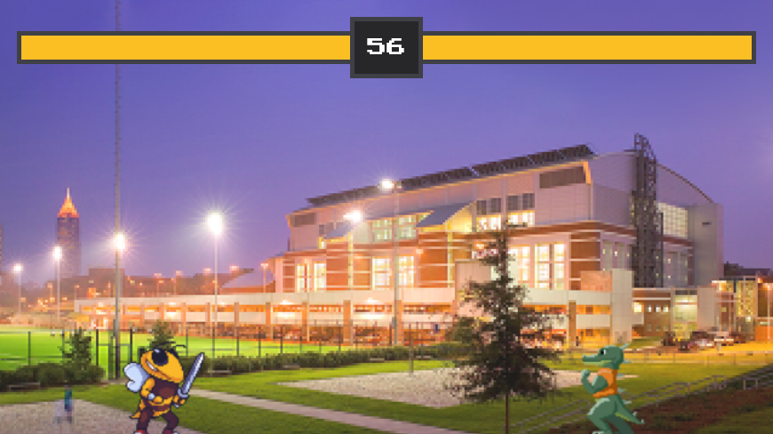

# BuzzKill

This is a project for the LMC2700 final group game assignment. It is a GT themed, two player, 2D fighting game. On the menu screen, press `Spacebar` to continue. Player one will play as Buzz by default. Player two chooses either the bulldog by pressing the `1` key, or the gator by pressing the `2` key. 

## Player One Controls
Move: WASD Keys\
Attack: `V` key

## Player Two Controls
Move: Arrow Keys\
Attack: `.` key

## Contributors
Jason Lei\
Victoria Nguyen\
Ansley Franks\
Luke Choi\
Rachel Young\

## Project Setup
This game is a Unity project. To access it, download the project as a ZIP, extract the folder, and open it as an existing project through Unity Hub.
